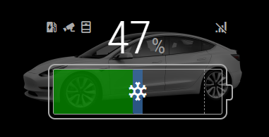

# MMM-Teslamate
## Magic Mirror Module for the Teslamate utility

## Graphic Mode


Big thanks to [olexs](https://github.com/olexs) for this mode!

## Table Mode
   

Big thanks to [adriankumpf](https://github.com/adriankumpf) for their incredible work on the [Teslamate](https://github.com/adriankumpf/teslamate) project,
as well as [aduyng](https://github.com/aduyng) for their [TeslaStatus](https://github.com/aduyng/MMM-TeslaStatus) module used as a template!

If you have any feedback or suggestions, feel free to submit a MR with a feature, or log an issue for a feature you'd like to see!

I use this module and Teslamate daily, so new MQTT topics should be added fairly regularly, but file an issue if I happen to miss one...

## Installation

* Requires an active installation of [Teslamate](https://github.com/adriankumpf/teslamate), with the MQTT (mosquitto) publisher configured.

Clone this repo into your MagicMirror modules directory using:

```git clone https://github.com/denverquane/MMM-Teslamate.git```

Then run `npm install` inside the new cloned folder, and make sure to add the module to your MagicMirror config (config/config.js), using configuration similar to that in the Configuration section below.

## Sample Configuration

```
{
    module: 'MMM-Teslamate',
    position: 'bottom_left',
    config: {
        mqttServer: {
            address: '192.168.1.13',  // Server address or IP address of the MQTT broker
            port: '1883'          // Port number if other than default (1883)
            //user: 'user',          // Leave out for no user
            //password: 'password',  // Leave out for no password
        },
        imperial: true, //use imperial units (false = Miles & F) or metric (true = Km & C)

        // set to true to enable both the graphic, and the additional stats (charge remaining, scheduled charge start, etc)
        hybridView: true,
        carImageOptions: {
            model: "m3", // mx, ms (S pre-refresh), ? (S post-refresh)

            view: "STUD_3QTR", // STUD_SIDE works better for S/X

            // full list of option codes: https://tesla-api.timdorr.com/vehicle/optioncodes.
            // you need at least the color and the wheels. not all combos work.
            // also consult: https://teslaownersonline.com/threads/teslas-image-compositor.7089/
            options: "PPSW,PFP31,W38B,DV4W",

            // play with this until it looks about right.
            // tested values: 0 for m3/STUD_3QTR, 25 for ms/STUD_SIDE
            verticalOffset: 0,

            opacity: 0.5
        }
    }
},
```

## Notes
* Some fields (charge added, time to full charge) are currently only enabled if the vehicle is plugged in

## Ongoing work
* ~~Add images of module~~
* Add support to selectively enable/disable certain lines
* ~~Selectively enable/disable certain fields based on other state (for example, still show scheduled charge time if plugged in)~~
* Display Teslamate "status" topic
* ~~Format and display Teslamate "scheduled charge time" topic~~
* ~~Proper Imperial/Metric conversion and formatting~~
