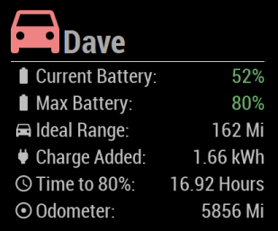
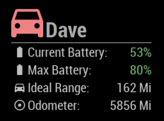

# MMM-Teslamate
## Magic Mirror Module for the Teslamate utility

  

Big thanks to [adriankumpf](https://github.com/adriankumpf) for their incredible work on the [Teslamate](https://github.com/adriankumpf/teslamate) project,
as well as [aduyng](https://github.com/aduyng) for their [TeslaStatus](https://github.com/aduyng/MMM-TeslaStatus) module used as a template!

If you have any feedback or suggestions, feel free to submit a MR with a feature, or log an issue for a feature you'd like to see!

I use this module and Teslamate daily, so new MQTT topics should be added fairly regularly, but file an issue if I happen to miss one...

## Installation

* Requires an active installation of [Teslamate](https://github.com/adriankumpf/teslamate), with the MQTT (mosquitto) publisher configured.

Clone this repo into your MagicMirror modules directory using:

```git clone https://github.com/denverquane/MMM-Teslamate.git```

Then run `npm install` inside the new cloned folder, and make sure to add the module to your MagicMirror config (config/config.js), using configuration similar to that in the Configuration section below.

## Sample Configuration

```
{
    module: 'MMM-Teslamate',
    position: 'bottom_left',
    config: {
        mqttServer: {
            address: '192.168.1.1',  // Server address or IP address of the MQTT broker
            port: '1883'          // Port number if other than default (1883)
            //user: 'user',          // Leave out for no user
            //password: 'password',  // Leave out for no password
        },
        imperial: true, //use imperial units (false = Miles & F) or metric (true = Km & C)
        batteryDanger: 30, //below this value, battery levels are red
        batteryWarning: 50, //below this value, battery levels are yellow
        //above the warning value, battery levels are green
	gMapsApiKey: "AIz...", //optional
        mapZoomLevel: 12
    }
},
```

You can obtain a Google Maps API key from [here](https://cloud.google.com/maps-platform/#get-started), but if no key is provided then the map iframe is disabled (to force the map to not display, simply omit or comment out your API key).

## Notes
* Some fields (charge added, time to full charge) are currently only enabled if the vehicle is plugged in

## Ongoing work
* ~~Add images of module~~
* Add any new MQTT topics as they are added to Teslamate
* Allow more customization of colors and text via config
* Make more aspects of config customizable
* Add support to selectively enable/disable certain lines
* Selectively enable/disable certain fields based on other state (for example, still show scheduled charge time if plugged in)
* Display Teslamate "status" topic
* Format and display Teslamate "scheduled charge time" topic
* ~~Proper Imperial/Metric conversion and formatting~~
